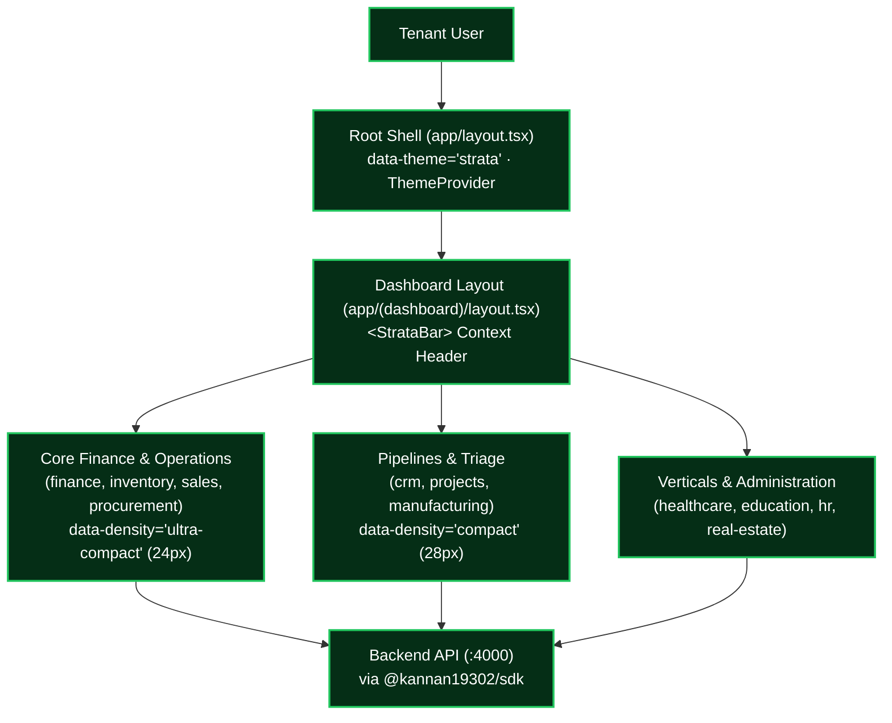

# Architecture Specification: UniERP Tenant Business Suite (Dashboard ERP) (`tenant-apps`)

- **Layer**: Layer L4 (Presentation)
- **Package Identity**: `@kannan19302/web`
- **Owning ADR**: [ADR-0010: UniERP Master Platform Goal and Polyrepo Architecture Boundaries](../unierp-platform/docs/adr/ADR-0010-platform-north-star-and-polyrepo-boundaries.md)
- **Status**: Authoritative & Production-Active

---

## 1. Executive Summary & Purpose

Primary ERP application suite (810 pages across 40+ business modules) providing operational workspaces powered by Strata Workbench.

This repository is one delivery unit in the UniERP 31-repository polyrepo estate, anchored by the **UniERP Master Platform North Star Goal**:
> "Build the world's premier autonomous, multi-tenant Enterprise SaaS Operating System: delivering 100% Zero-Trust Multi-Tenant Isolation with PostgreSQL Row-Level Security on every tenant table, Absolute Decimal(19,4) Numeric Precision across all ledgers, Atomic Durable Audit Logging, Sub-100ms P99 Transaction Latency, and a Unified High-Density Strata Workbench Design Language across all 1,198 web routes, native mobile, and desktop clients."

---

## 2. System Context & Architectural Boundaries

### Boundary Contract
- **Allowed Inbound Consumers**: Tenant business users, accountants, inventory managers, HR
- **Allowed Outbound Dependencies**: @kannan19302/ui (L1); @kannan19302/contracts (L0); @kannan19302/auth (L1); L3 via HTTP/SDK
- **Strictly Forbidden Dependencies**:
  - ❌ Direct database ORM (@kannan19302/database)
  - ❌ Bypassing tenant scope
  - ❌ L5-L7

---

## 3. Technology Stack & Key Primitives

- **Core Runtime & Languages**: Next.js 14/15, React 19, Strata Workbench, TypeScript
- **Primary Interface**: `@kannan19302/web`
- **Verification Harness**: `pnpm typecheck`

---

## 4. Quality Engineering & Verification Gates

To maintain institutional reliability, this repository is governed by the following continuous quality gates:
1. **Type Safety Gate**: Zero TypeScript/type-checker errors under strict mode.
2. **Layer Boundary Gate**: Verified by `scripts/check-layer.mjs` in `unierp-workspace` to prevent illegal upward or sideways coupling.
3. **Automated Test Suite**: Must execute cleanly with 100% pass rate before branch integration.

---

## 5. Associated AI Skills & Governance Links

- **Project Skill**: [`.agents/skills/tenant-apps-standards/SKILL.md`](.agents/skills/tenant-apps-standards/SKILL.md)
- **Workspace Governance**: [`../unierp-workspace/governance/UNIERP_MASTER_PLATFORM_GOAL.md`](../unierp-workspace/governance/UNIERP_MASTER_PLATFORM_GOAL.md)
- **Canonical Protocol**: [`../unierp-platform/docs/standards/AI_AGENT_DEVELOPMENT_PROTOCOL.md`](../unierp-platform/docs/standards/AI_AGENT_DEVELOPMENT_PROTOCOL.md)
